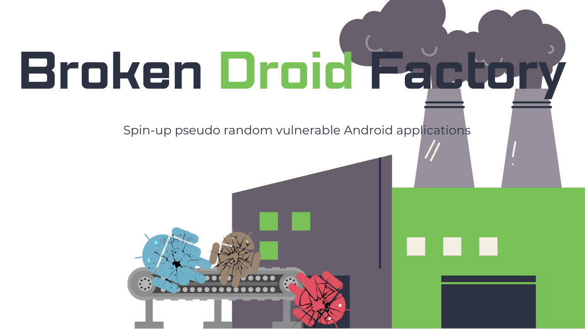

<p align="center">
    
  </a>
</p>
<p align="center"> 🤖 Create vulnerable Android apps for testing & training in seconds. 📱 </p>

<br>

BDF is a Python tool designed to spin-up pseudo random vulnerable Android applications for vulnerability research, ethical hacking, and pen testing Android app practice. 
- To get started, download the dependancies and run ```BrokenDroidFactory.py```, it's as simple as that! ✔️
- Create a pseudo random Android APK that contains an assortment of vulnerable and issue prone code. 💀
- After run, a ```README.md``` file is created detailing the app's issues and vulnerabilities. 📝 

# ➡️ Getting Started 
## Installation 
After cloning the repository all BDF dependencies can be installed manually or via the requirements file, with:

``` bash
pip install -r REQUIREMENTS.txt
```

In addition to the above, you will also need a copy of the Android SDK. If you do not have this already [it can be downloaded here](https://developer.android.com/studio) you will then need to add a file to the relative path of ```Broken-Droid-Factory\demoapp\local.properties``` - in this file add the path to your SDK, for example:

```
sdk.dir=C\:\\Users\\<username>\\AppData\\Local\\Android\\Sdk
```

The simplest way to do this, is to download [Android Studio](https://developer.android.com/studio) and then open the project ```Broken-Droid-Factory\demoapp``` inside of it. Android Studio will then do the rest and setup the necessary files and dependancies. Once complete you can close Android Studio and move back to BDF.

BDF has been tested on Windows 10.

## Usage
Run BDF with Python:
```bash
python BrokenDroidFactory.py
```

Several optional pramiters can be provided to BDF, use ```-h``` to see a full list:

```
  -h, --help            Show this help message and exit.
  -o OUTPUT, --output OUTPUT
                        The output directory for the compiled APK to be saved
                        to.
  -t TEMPLATE, --template TEMPLATE
                        The path to the template app. Do not alter unless you
                        know what you're doing.
  -c CHALLENGE, --challenge CHALLENGE
                        The desired challenge level for the created APK.
  -v, --verbose         Increase output verbosity.
```

After running BDF to completion you will be left with 2 files in the output directory (```out``` if not provided). A ```README.md``` file detailing the workings and the types of challenges in the app, and an ```.apk``` file.

# 🏅 Types Of Challenges
Use BDF to create vulnerable and issue prone Android applications in the below categories:
- Broken Crypto: Insecure Algorithm Usage ✅
- Broken Crypto: Predictable Key Material ✅
- Exploitable Exported Activities ✅
- Insecure Data Storage ❌
- Sensitive Data In Memory ✅
- Tapjacking ❌
- Task hijacking ❌

# ⚗️ Creating Your Own Patchers
Patchers are used by BDF to modify a template application source and add vulnerable and issue prone code to it. A patcher must have several key aspects and have this purpose in mind. However, outside of this how patchers are implemented is quite flexible and modular.
- A patcher should be saved to the ```patchers``` directory.
- A patcher should inherit ```patcher_interface.patcher```
- A patcher should have a member variable of ```difficulty``` set to an int value between 0 and 10 - where 0 means it provides no challenge and is used to add variability to the app, and a number higher than 0 denotes it's difficulty score to complete (with the higher the score the more difficult it is).
- A patcher should have a ```patch``` function (of which is automatically run when the patcher is called by BDF) and should return a string based on what the patcher has done.
- A reference to your created patcher class should be added to the ```patcher_list``` list variable in ```BrokenDroidFactory.py```
