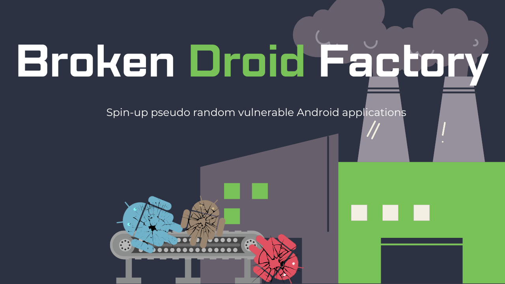

<p align="center">
    
  </a>
</p>
<p align="center"> 🤖 Spin-up pseudo random vulnerable Android applications. 📱 </p>

<br>

BDF is a Python tool designed to spin-up pseudo random vulnerable Android applications for vulnerability research, ethical hacking, and pen testing Android app practice. 
- To get started, download the dependancies and run ```BrokenDroidFactory.py```, it's as simple as that! ✔️
- Create a pseudo random Android APK that contains an assortment of vulnerable and issue prone code. 💀
- After run a ```README.md``` file is created detailing the app's issues and vulnerabilities. 📝

# ➡️ Getting Started 
## Installation 
After cloning the repository all BDF dependencies can be installed manually or via the requirements file, with:

``` bash
pip install -r REQUIREMENTS.txt
```

BDF has been tested on Windows 10.

## Usage
Run BDF with Python:
```bash
python BrokenDroidFactory.py
```

Several optional pramiters can be provided to BDF, use ```-h``` to see a full list of options:

```bash
  -h, --help            Sshow this help message and exit
  -o OUTPUT, --output OUTPUT
                        The output directory for the compiled APK to be saved
                        to.
  -t TEMPLATE, --template TEMPLATE
                        The path to the template app. Do not alter unless you
                        know what you're doing.
  -c CHALLENGE, --challenge CHALLENGE
                        The desired challenge level for the created APK.
  -v, --verbose         Increase output verbosity.
```

# 🏅 Types Of Challenges
Use BDF to create vulnerable and issue prone Android applications in the below categories:
- Broken Crypto: Insecure Algorithm Usage ✅
- Broken Crypto: Predictable Key Material ✅
- Exploitable Exported Activities ✅
- Insecure Data Storage ✅
- Sensitive Data In Memory ❌
- Tapjacking ❌
- Task hijacking ❌

# ⚗️ Creating Your Own Patchers
Patchers are used by BDF to modify a template application source and add vulnerable and issue prone code to it. A patcher must have several key aspects and have this purpose in mind. However, outside of this how patchers are implemented is quite flexible and modular.
- A patcher should be saved to the ```patchers``` directory.
- A patcher should inherit ```patcher_interface.patcher```
- A patcher should have a member variable of ```difficulty``` set to a boolean value between 0 and 10, where 0 means it provides no challenge and is used to add variability to the app, and a number higher than 0 denotes it's difficulty score to complete.
- A patcher should have a ```patch``` function that is run when the patcher is called by BDF and should return a string based on what the patcher has done.
- A reference to your created patcher class should be added to the ```patcher_list``` list variable in ```BrokenDroidFactory.py```
